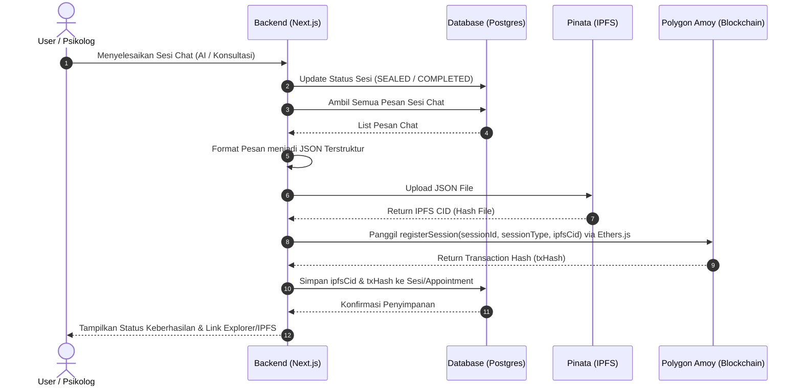

# PRD & Arsitektur Integrasi Blockchain — Jembatan Aman

Dokumen ini menjelaskan spesifikasi produk, alur kerja (workflow), dan detail teknis untuk mengintegrasikan teknologi blockchain ke dalam platform **Jembatan Aman** (sebelumnya dikenal sebagai **Ruang**). Fitur ini bertujuan untuk mengamankan riwayat sesi chat (baik dengan AI maupun Psikolog) ke dalam IPFS (via Pinata) dan merekam buktinya secara permanen pada blockchain (Polygon Amoy Testnet).

---

## 1. Analisis Arsitektur Smart Contract

### Pertanyaan: Apakah membutuhkan 1 contract saja untuk menangani 2 alur sekaligus, atau membutuhkan 2 contract berbeda?

> [!IMPORTANT]
> **Keputusan Arsitektur: 1 Smart Contract (`SessionRegistry.sol`)**

Kami merekomendasikan dan menetapkan penggunaan **1 Smart Contract** terpusat untuk menangani pencatatan sesi Chat AI maupun Chat Psikolog. Berikut adalah analisis perbandingannya:

| Parameter | 1 Smart Contract (Rekomendasi) | 2 Smart Contract Terpisah |
| :--- | :--- | :--- |
| **Kompleksitas Kode** | **Rendah**: Hanya perlu 1 codebase Solidity yang bersih dan mudah dipelihara. | **Sedang**: Harus memelihara dua kontrak berbeda (`AiRegistry` dan `PsychologistRegistry`). |
| **Biaya Gas (Deployment)** | **Sangat Hemat**: Hanya melakukan 1 kali transaksi deploy ke Polygon Amoy Testnet. | **Boros**: Membutuhkan 2 kali transaksi deployment terpisah. |
| **Integrasi Backend** | **Mudah & Efisien**: Backend Next.js hanya perlu menyimpan 1 alamat kontrak (Contract Address) dan 1 ABI. | **Rumit**: Backend harus memetakan dua alamat kontrak dan dua ABI yang berbeda berdasarkan tipe sesi. |
| **Kueri Data (On-chain)** | **Terpusat**: Memudahkan pencarian seluruh riwayat integritas sesi seorang user di satu tempat menggunakan filter `sessionType`. | **Terfragmentasi**: Harus melakukan pemanggilan ke dua alamat kontrak berbeda untuk menyatukan data. |
| **Keamanan & Kontrol** | **Sangat Aman**: Hak akses menulis ke blockchain (write access) dikelola dengan Role-Based Access Control (RBAC) atau standard `Ownable` di satu tempat. | **Redundan**: Harus menyalin logika kontrol akses yang sama di kedua kontrak. |

### Cara Membedakannya dalam 1 Kontrak:
Dalam smart contract tunggal ini, kita mendefinisikan tipe sesi menggunakan **`enum SessionType`** atau **`uint8`**:
```solidity
enum SessionType { AI, Psychologist }
```
Setiap kali sesi dicatat, data dikirimkan bersama tipe sesinya. Hal ini sangat menghemat resource dan mempercepat waktu implementasi selama Hackathon.

---

## 2. Alur Kerja (Workflow) Sistem

Pencatatan sesi chat dilakukan secara asinkron di backend setelah sesi dinyatakan berakhir. Pengguna tidak perlu membayar gas fee (gasless transaction bagi user) karena backend menggunakan private key sistem (admin wallet) untuk menandatangani dan mengirim transaksi ke blockchain.

### 2.1 Alur Chat AI (Lombut AI)
1. **Chat 7 Turn**: User melakukan chat dengan AI hingga mencapai batas 7 turn (14 pesan bolak-balik).
2. **Sesi Selesai**: Sistem mendeteksi turn ke-7 telah selesai dan menandai status `ChatSession` sebagai `SEALED` atau `COMPLETED`.
3. **Konversi JSON**: Backend mengambil seluruh pesan dalam sesi tersebut dari database PostgreSQL dan mengubahnya menjadi format JSON terenkripsi/terstruktur.
4. **Upload Pinata (IPFS)**: JSON diunggah ke Pinata. Pinata mengembalikan **CID (Content Identifier)** unik.
5. **Kirim ke Blockchain**: Backend memanggil fungsi `registerSession` pada smart contract di Polygon Amoy Testnet, mengirimkan `sessionId`, `sessionType` (0 = AI), `ipfsCid`, dan metadata pendukung.
6. **Menerima Hash Transaksi**: Blockchain memvalidasi transaksi dan mengembalikan **Transaction Hash**.
7. **Simpan di Backend**: Backend menyimpan Transaction Hash dan CID IPFS ke dalam tabel `ChatSession` di database PostgreSQL sebagai bukti integritas data.

### 2.2 Alur Chat Psikolog
1. **Sesi Konsultasi Berakhir**: Ketika waktu countdown chat real-time habis atau psikolog menutup sesi di halaman `/konsultasi`, appointment berstatus `COMPLETED`.
2. **Konversi JSON**: Backend mengambil semua pesan `ConsultationMessage` dari `Appointment` terkait dan mengubahnya menjadi JSON.
3. **Upload Pinata (IPFS)**: JSON diunggah ke Pinata untuk mendapatkan **CID**.
4. **Kirim ke Blockchain**: Backend memanggil fungsi `registerSession` pada smart contract yang sama, mengirimkan `sessionId` (ID Appointment), `sessionType` (1 = Psychologist), `ipfsCid`, dan wallet address psikolog terkait.
5. **Menerima Hash Transaksi**: Blockchain memproses transaksi dan mengembalikan **Transaction Hash**.
6. **Simpan di Backend**: Backend menyimpan Transaction Hash dan CID IPFS ke dalam tabel `Appointment` di database PostgreSQL.



---

## 3. Rencana Desain Data & Database Schema

Untuk menyimpan hasil integrasi blockchain, kita perlu menambahkan dua field opsional baru pada skema database PostgreSQL melalui Prisma:
1. `ipfsCid`: Menyimpan alamat file riwayat chat di IPFS.
2. `txHash`: Menyimpan hash transaksi blockchain sebagai bukti audit.

### 3.1 Perubahan pada `prisma/schema.prisma`

```diff
model ChatSession {
  id             String            @id @default(cuid())
  userId         String
  status         ChatSessionStatus @default(ACTIVE)
  user           User              @relation(fields: [userId], references: [id], onDelete: Cascade)
  createdAt      DateTime          @default(now())
  updatedAt      DateTime          @updatedAt
  chatMessages   ChatMessage[]
  sessionSummary SessionSummary?
+ ipfsCid        String?           // Alamat IPFS riwayat chat AI
+ txHash         String?           // Bukti transaksi on-chain
}

model Appointment {
  id                   String            @id @default(cuid())
  userId               String
  psychologistId       String
  scheduledAt          DateTime
  status               AppointmentStatus @default(SCHEDULED)
  createdAt            DateTime          @default(now())
  updatedAt            DateTime          @updatedAt
  user                 User              @relation(fields: [userId], references: [id], onDelete: Cascade)
  psychologistProfile  PsychologistProfile @relation(fields: [psychologistId], references: [id], onDelete: Cascade)
  consultationMessages ConsultationMessage[]
+ ipfsCid              String?           // Alamat IPFS riwayat chat konsultasi
+ txHash               String?           // Bukti transaksi on-chain
}
```

---

## 4. Spesifikasi Smart Contract (`SessionRegistry.sol`)

Berikut adalah draft smart contract Solidity yang akan di-deploy ke **Polygon Amoy Testnet** menggunakan Remix IDE.

```solidity
// SPDX-License-Identifier: MIT
pragma solidity ^0.8.20;

/**
 * @title SessionRegistry
 * @dev Menyimpan hash audit (IPFS CID) untuk sesi konsultasi psikologi dan chat AI.
 */
contract SessionRegistry {
    
    // Enum untuk membedakan tipe sesi obrolan
    enum SessionType { AI, Psychologist }

    // Struct untuk menyimpan detail rekaman sesi
    struct SessionRecord {
        string sessionId;
        SessionType sessionType;
        string ipfsCid;
        uint256 timestamp;
        address registeredBy;
    }

    // Owner contract (Backend System Wallet)
    address public owner;

    // Mapping dari sessionId ke SessionRecord
    mapping(string => SessionRecord) private _sessions;
    
    // Mapping untuk mengecek apakah sessionId sudah terdaftar
    mapping(string => bool) private _isRegistered;

    // Events untuk pencatatan log off-chain
    event SessionRegistered(
        string indexed sessionId, 
        SessionType indexed sessionType, 
        string ipfsCid, 
        uint256 timestamp,
        address indexed registeredBy
    );

    // Modifier untuk membatasi akses hanya untuk owner
    modifier onlyOwner() {
        require(msg.sender == owner, "Hanya owner yang dapat melakukan aksi ini");
        _;
    }

    constructor() {
        owner = msg.sender;
    }

    /**
     * @dev Mendaftarkan sesi baru ke blockchain
     * @param sessionId ID unik dari database backend
     * @param sessionType Tipe sesi (0 = AI, 1 = Psychologist)
     * @param ipfsCid CID file JSON dari Pinata IPFS
     */
    function registerSession(
        string calldata sessionId,
        SessionType sessionType,
        string calldata ipfsCid
    ) external onlyOwner {
        require(bytes(sessionId).length > 0, "Session ID tidak boleh kosong");
        require(bytes(ipfsCid).length > 0, "IPFS CID tidak boleh kosong");
        require(!_isRegistered[sessionId], "Sesi sudah pernah terdaftar");

        _sessions[sessionId] = SessionRecord({
            sessionId: sessionId,
            sessionType: sessionType,
            ipfsCid: ipfsCid,
            timestamp: block.timestamp,
            registeredBy: msg.sender
        });

        _isRegistered[sessionId] = true;

        emit SessionRegistered(sessionId, sessionType, ipfsCid, block.timestamp, msg.sender);
    }

    /**
     * @dev Mengambil data sesi berdasarkan sessionId
     */
    function getSession(string calldata sessionId) 
        external 
        view 
        returns (
            string memory id,
            SessionType sessionType,
            string memory ipfsCid,
            uint256 timestamp,
            address registeredBy
        ) 
    {
        require(_isRegistered[sessionId], "Sesi tidak ditemukan");
        SessionRecord memory record = _sessions[sessionId];
        return (
            record.sessionId,
            record.sessionType,
            record.ipfsCid,
            record.timestamp,
            record.registeredBy
        );
    }

    /**
     * @dev Mengecek apakah sesi sudah terdaftar
     */
    function isSessionRegistered(string calldata sessionId) external view returns (bool) {
        return _isRegistered[sessionId];
    }

    /**
     * @dev Transfer ownership ke wallet backend baru jika diperlukan
     */
    function transferOwnership(address newOwner) external onlyOwner {
        require(newOwner != address(0), "Owner baru tidak boleh address nol");
        owner = newOwner;
    }
}
```

---

## 5. Rencana Integrasi & Kode Pendukung (Ethers.js & Pinata)

### 5.1 Kebutuhan Konfigurasi Environment (`.env`)
```env
# Pinata Credentials
PINATA_JWT="your_pinata_jwt_here"
PINATA_GATEWAY_URL="https://gateway.pinata.cloud/ipfs/"

# Blockchain Configurations
BLOCKCHAIN_RPC_URL="https://rpc-amoy.polygon.technology"
BLOCKCHAIN_PRIVATE_KEY="your_backend_wallet_private_key"
BLOCKCHAIN_CONTRACT_ADDRESS="0x..."
```

### 5.2 Skema Integrasi Pinata (Menggunakan REST API / SDK)
Mengunggah JSON secara langsung menggunakan Fetch API di Next.js:
```typescript
async function uploadToPinata(chatHistory: any, sessionId: string): Promise<string> {
  const response = await fetch("https://api.pinata.cloud/pinning/pinJSONToIPFS", {
    method: "POST",
    headers: {
      "Content-Type": "application/json",
      Authorization: `Bearer ${process.env.PINATA_JWT}`,
    },
    body: JSON.stringify({
      pinataContent: {
        sessionId,
        timestamp: new Date().toISOString(),
        messages: chatHistory,
      },
      pinataMetadata: {
        name: `jembatan-aman-session-${sessionId}.json`,
      },
    }),
  });
  
  if (!response.ok) {
    throw new Error("Gagal mengunggah riwayat chat ke Pinata IPFS");
  }

  const data = await response.json();
  return data.IpfsHash; // CID
}
```

### 5.3 Skema Integrasi Blockchain via Ethers.js
Menggunakan Ethers.js di Route Handler Next.js untuk memanggil Smart Contract:
```typescript
import { ethers } from "ethers";

const ABI = [
  "function registerSession(string calldata sessionId, uint8 sessionType, string calldata ipfsCid) external",
  "function getSession(string calldata sessionId) external view returns (string, uint8, string, uint256, address)"
];

async function registerOnChain(sessionId: string, sessionType: number, ipfsCid: string): Promise<string> {
  const provider = new ethers.JsonRpcProvider(process.env.BLOCKCHAIN_RPC_URL);
  const wallet = new ethers.Wallet(process.env.BLOCKCHAIN_PRIVATE_KEY!, provider);
  const contract = new ethers.Contract(process.env.BLOCKCHAIN_CONTRACT_ADDRESS!, ABI, wallet);

  // Kirim transaksi ke Polygon Amoy
  const tx = await contract.registerSession(sessionId, sessionType, ipfsCid);
  
  // Tunggu 1 konfirmasi block
  const receipt = await tx.wait();
  
  return receipt.hash; // transaction hash
}
```

---

## 6. Rencana Verifikasi & Pengujian

### 6.1 Uji Smart Contract di Remix IDE
- Compile `SessionRegistry.sol` menggunakan Compiler versi `0.8.20` ke atas.
- Deploy di environment Remix VM (London) untuk tes fungsi dasar (`registerSession`, `getSession`).
- Simulasikan pencatatan ganda pada ID yang sama untuk memastikan validasi `require(!_isRegistered[sessionId])` berhasil menolak.

### 6.2 Deploy ke Polygon Amoy Testnet
- Sambungkan MetaMask ke Polygon Amoy Testnet.
- Minta token gratis (Faucet MATIC) di Amoy Faucet.
- Deploy `SessionRegistry.sol` dari Remix ke Amoy menggunakan provider "Injected Provider - MetaMask".
- Catat alamat kontrak yang dihasilkan.

### 6.3 Integrasi & Uji Backend (E2E)
- Jalankan integrasi lokal dan pastikan API memproses turn chat ke-7 secara otomatis.
- Periksa log konsol untuk memastikan file JSON terunggah ke Pinata IPFS.
- Validasi transaksi masuk di [Amoy Polygonscan](https://amoy.polygonscan.com/) menggunakan transaction hash yang disimpan di DB PostgreSQL.
