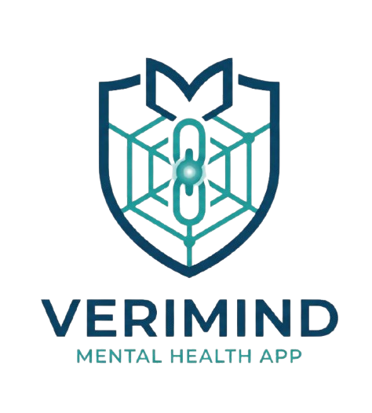
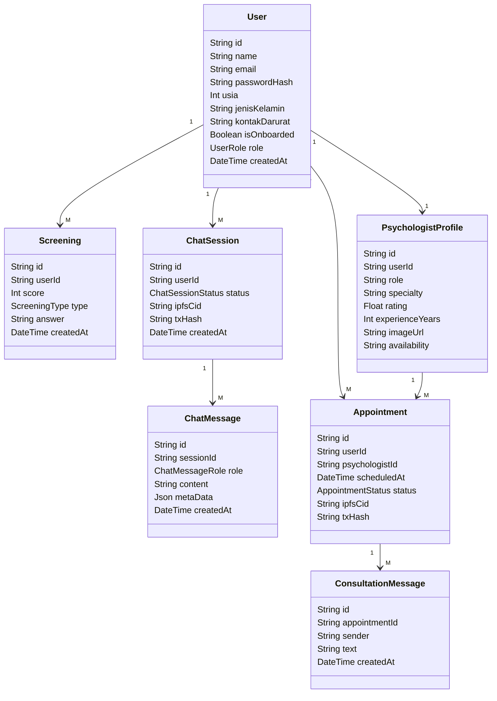

# **Verimind — Platform Pertolongan Pertama Psikologis dengan Integritas On-Chain**

*(Sebelumnya dikenal sebagai **Ruang** / **Jembatan Aman**)*

---

<p align="center">
  
</p>

[](https://nextjs.org)
[](https://bun.sh)
[](https://prisma.io)
[](https://postgresql.org)
[](https://polygon.technology)
[](https://deepmind.google/technologies/gemini/)
[](https://pusher.com)

---

## 📌 Ringkasan Eksekutif

**Verimind** adalah Platform Pertolongan Pertama Psikologis (*Psychological First Aid*) inovatif yang dirancang khusus sebagai **"jembatan aman"** bagi individu yang merasa ragu, bingung, cemas, atau sekadar ingin tahu tentang kondisi kesehatan mental mereka sebelum memutuskan untuk bertemu ahli profesional. 

Dengan menyatukan teknologi **Empathetic AI** (didukung oleh Google Gemini) untuk validasi awal, **Dynamic Theming** yang adaptif terhadap emosi pengguna, dan **Web3 & Blockchain** (Polygon Amoy & IPFS Pinata) untuk menjamin integritas rekam medis sesi obrolan secara nir-ubah (*immutable*), Verimind menawarkan solusi kesehatan mental modern yang aman, privat, dan tanpa hambatan stigma.

---

## ⚠️ Latar Belakang & Permasalahan

Kesehatan mental sering kali diabaikan atau ditunda penanganannya karena beberapa hambatan utama:
1. **Kebingungan & Keraguan Diri**: Banyak orang merasa ragu apakah tingkat kecemasan atau kesedihan yang dialami sudah "cukup serius" untuk dibawa ke psikolog.
2. **Stigma Sosial & Hambatan Finansial**: Hambatan stigma sosial di masyarakat dan kekhawatiran biaya konsultasi membuat orang menunda mencari pertolongan.
3. **Keterbatasan Konteks bagi Profesional**: Psikolog sering memulai sesi konsultasi dari nol tanpa adanya konteks atau riwayat kondisi emosional terstruktur dari klien, yang memakan waktu sesi untuk klarifikasi awal.

---

## 💡 Solusi & Nilai Tambah (Value Proposition)

Verimind memecahkan masalah ini dengan menghadirkan alur onboarding bertahap yang ramah pengguna:
* **Deteksi Ringan**: Mengidentifikasi kondisi awal tanpa kesan menghakimi melalui kuesioner interaktif.
* **Pendampingan Anonim**: Menyediakan chatbot pendengar yang memvalidasi perasaan dan melacak fluktuasi mood pengguna secara mandiri.
* **Integrasi Profesional**: Menyusun ringkasan kondisi klinis secara otomatis untuk mempercepat diagnosa psikolog mitra ketika pengguna dirujuk.

### Manfaat bagi Stakeholder

| Stakeholder | Manfaat Utama |
| :--- | :--- |
| **Pengguna / Klien** | Mengenali kondisi mental secara dini tanpa stigma, memiliki wadah curhat aman 24/7, mendapatkan rekomendasi bantuan secara proaktif, dan riwayat datanya dijamin aman dengan enkripsi & pembuktian on-chain. |
| **Psikolog Mitra** | Menerima berkas *Briefing Klien* otomatis (tren mood + rangkuman AI sesi sebelumnya) sebelum sesi dimulai, mempercepat penanganan, dan memiliki sertifikasi penyelesaian sesi yang transparan dengan tanda tangan kriptografis. |
| **Platform** | Keunggulan kompetitif berupa *data integrity* berbasis Web3 yang menjamin bahwa catatan sesi tidak dapat dimanipulasi oleh pihak ketiga manapun (termasuk admin platform). |

---

## 🎯 Tujuan Produk (SMART Goals)
* **G1 (Screening)**: Mencapai completion rate kuesioner awal $\ge 80\%$ melalui antarmuka multi-step yang adaptif dan interaktif.
* **G2 (AI Chatbot)**: Rata-rata durasi sesi curhat bersama AI pendengar $\ge 5$ menit guna memastikan pengguna merasa didengar dan divalidasi.
* **G3 (Rujukan)**: Konversi rujukan ke psikolog mitra $\ge 10\%$ bagi pengguna yang terindikasi membutuhkan bantuan profesional.
* **G4 (Konteks Medis)**: $100\%$ pemesanan konsultasi psikolog dilengkapi dengan *Medical Brief* yang terstruktur.
* **G5 (Integritas)**: $100\%$ hash dokumen riwayat obrolan konsultasi yang selesai tercatat di smart contract Polygon Amoy.

---

## 🛠️ Pilar Utama Fitur & Alur Kerja (Workflow)

Verimind dibangun di atas tiga pilar utama yang saling terhubung secara runtut:

```
[ Screening Awal ] ──(Kalkulasi Skor)──► [ Penyesuaian Tema UI ]
                                                   │
                                           (Mulai Curhat)
                                                   ▼
[ Rujukan Profesional ] ◄──(Rekomendasi AI)── [ Very AI Chatbot ]
         │
    (Booking)
         ▼
[ Chat Konsultasi Real-time ] ──(Selesai)──► [ Enkripsi & Upload IPFS ]
                                                   │
                                                   ▼
                                        [ Register On-Chain Hash ]
```

### 1. Kenali (Screening Awal & Harian)
* **Screening Onboarding**: Terdiri atas kuesioner interaktif 5 langkah (Mood Selector dengan emoji + 4 pertanyaan berbasis skala Likert mengenai kecemasan, kualitas tidur, energi, dan pikiran negatif).
* **Screening Harian**: Formulir 3 pertanyaan cepat ($\le 60$ detik) untuk memetakan grafik perkembangan mood 7 hari terakhir di dashboard.
* **Adaptasi UI Dinamis (Dynamic Theming)**: Hasil klasifikasi skor screening mengaktifkan salah satu dari 4 tema antarmuka secara global:
  - `calm_blue` (🌤️ Kondisi Baik): Palet warna biru laut yang tenang dengan tipografi Sora & Inter.
  - `warm_yellow` (🌥️ Kondisi Sedang/Lelah): Nuansa hangat dengan tipografi Outfit & Lexend.
  - `alert_orange` (🌧️ Kondisi Perlu Perhatian): Warna jingga lembut untuk menenangkan kecemasan dengan Space Grotesk & Plus Jakarta Sans.
  - `deep_purple` (⛈️ Kondisi Butuh Pendampingan): Palet ungu mendalam yang suportif dengan Playfair Display & DM Sans.

### 2. Validasi (Very AI Chatbot)
* **Sapaan Awal Kontekstual**: AI (Google Gemini 2.5/3.1 Flash) memulai percakapan berdasarkan status mood dan hasil kuesioner terbaru pengguna, menciptakan interaksi yang sangat personal.
* **Dukungan & Validasi Emosional**: Dirancang khusus menggunakan *system prompt* terstruktur untuk memvalidasi emosi (*active listening*), merefleksikan perasaan, dan melarang diagnosis medis mandiri oleh AI.
* **Deteksi Krisis & Peringatan Darurat**: Jika AI mendeteksi pesan yang mengandung indikasi krisis (*self-harm* atau ideasi bunuh diri), sistem segera memicu **Modal Peringatan Darurat (Hotline Crisis Alert)** berwarna merah menyala secara otomatis selama 3 detik, lengkap dengan nomor telepon darurat nasional (Yayasan Pulih, Kemenkes 119 Ext 8, Into The Light).

### 3. Arahkan (Rujukan & Konsultasi Profesional)
* **Trigger Rujukan**: Kombinasi deteksi krisis aktif, kategori skor screening berat, atau permintaan eksplisit pengguna memicu kemunculan banner rujukan ke psikolog mitra.
* **Pencarian & Pemesanan Terjadwal**: Pengguna dapat mencari psikolog berdasarkan spesialisasi (PTSD, Kecemasan, Remaja, Depresi), membaca profil/rating, dan memesan jadwal konsultasi (GRATIS untuk MVP guna meminimalkan regulasi billing medis).
* **Obrolan Real-time (Pusher Integration)**: Ketika jadwal konsultasi tiba, bilik obrolan real-time teraktifkan dengan countdown timer, indikator online/offline lawan bicara, dan status pengetikan (*typing indicator*).
* **Dashboard Psikolog**: Menyediakan antrean jadwal, kontrol aksi terima/tolak konsultasi, berkas riwayat emosional klien (brief), dan editor catatan pasca-konsultasi.

### 4. Web3 & Blockchain (Integritas Data Sesi)
Verimind menerapkan arsitektur penyimpanan hibrida untuk melindungi riwayat percakapan dari manipulasi internal maupun eksternal:
* **Upload ke IPFS (Pinata)**: Ketika obrolan Very AI mencapai 7 turn atau chat Psikolog ditutup, backend Next.js mengonversi pesan ke format JSON terenkripsi dan mengunggahnya ke IPFS via Pinata untuk mendapatkan CID (Content Identifier) unik.
* **Pencatatan Smart Contract**: Backend menandatangani transaksi gasless (sistem membayar gas fee menggunakan Admin Wallet) dan memanggil fungsi `registerSession` pada smart contract `SessionRegistry` di Polygon Amoy Testnet untuk mengunci CID, jenis sesi, dan timestamp.
* **Sistem Audit Transparansi (Hot vs Cold Storage)**:
  - Data aktif tersimpan di PostgreSQL agar UI memuat halaman secara instan.
  - Sesi yang telah terkunci menampilkan lencana **"🛡️ Terverifikasi Aman (On-Chain)"**.
  - Mengklik lencana memicu proses validasi: backend menghitung hash SHA-256 data lokal, mencocokkannya dengan CID yang diperoleh dari Smart Contract, dan mengunduh file IPFS untuk menjamin bahwa data di database lokal tidak pernah dimodifikasi sepihak.

---

## 🧬 Arsitektur Teknologi (Tech Stack)

Verimind menggunakan arsitektur monorepo Next.js modern dengan teknologi mutakhir:

* **Frontend**: Next.js 16 (App Router) dengan TypeScript untuk performa server-side rendering (SSR) optimal.
* **Styling**: Tailwind CSS v4 + shadcn/ui untuk sistem desain antarmuka premium dan responsif.
* **Database & ORM**: PostgreSQL dijalankan dalam container Docker Alpine dengan Prisma ORM (Client output terarah ke folder internal `@/generated/prisma`).
* **Autentikasi**: Auth.js v5 (NextAuth) terintegrasi native dengan PostgreSQL via `@auth/prisma-adapter` menggunakan strategi database session.
* **Pengolah Form & Validasi**: TanStack Form + Zod schema validator.
* **State & Data Fetching**: Zustand (global client state) + TanStack Query v5 (cache & mutasi API).
* **Koneksi Real-time**: Pusher Channels (Websocket connection untuk chat dua arah, typing indicator, dan sinkronisasi booking status).
* **Integrasi AI**: Google Gemini SDK (`gemini-2.5-flash` untuk respon chat cepat, `gemini-2.5-pro` untuk ekstraksi brief kuesioner, dan fallback ke `gemini-3.1-flash-lite`).
* **Web3 / Smart Contract**: Solidity v0.8.20, Ethers.js v6 (backend interaction), Pinata API (IPFS gateway), dan Polygon Amoy Testnet sebagai L2 ledger murah.
* **Development Runtime**: Bun.js (v1.3.9) untuk instalasi dependency super cepat dan stabilitas eksekusi package.

---

## 🗄️ Desain Skema Database (Prisma Schema)

Berikut adalah struktur entitas utama pada database PostgreSQL yang diatur melalui Prisma ORM:



---

## 📜 Spesifikasi Smart Contract (`SessionRegistry.sol`)

Smart contract ditulis menggunakan Solidity compiler `v0.8.20` dan di-deploy ke **Polygon Amoy Testnet**.

### Struktur Data & Fungsi Utama

* **`enum SessionType`**: Membedakan catatan obrolan (0 = `AI`, 1 = `Psychologist`).
* **`struct SessionRecord`**: Menyimpan metadata audit:
  - `sessionId` (String): ID Unik dari database backend.
  - `sessionType` (SessionType): Kategori sesi.
  - `ipfsCid` (String): CID IPFS dari Pinata.
  - `timestamp` (uint256): Waktu pencatatan.
  - `registeredBy` (address): Wallet pengirim (Admin Wallet).
* **Fungsi `registerSession`**:
  ```solidity
  function registerSession(
      string calldata sessionId,
      SessionType sessionType,
      string calldata ipfsCid
  ) external onlyOwner
  ```
  Fungsi ini dipanggil oleh backend Next.js setelah sesi selesai. Menggunakan modifier `onlyOwner` agar hanya backend tepercaya yang dapat mencatat data sesi ke blockchain.
* **Fungsi `getSession`**:
  ```solidity
  function getSession(string calldata sessionId) 
      external 
      view 
      returns (
          string memory id,
          SessionType sessionType,
          string memory ipfsCid,
          uint256 timestamp,
          address registeredBy
      )
  ```
  Fungsi publik untuk mengambil data audit guna kebutuhan proses sinkronisasi dan verifikasi lokal.

---

## ⚙️ Cara Penggunaan & Panduan Instalasi (Getting Started)

Ikuti langkah-langkah berikut untuk menjalankan Verimind di lingkungan pengembangan lokal Anda:

### Prasyarat
* Pasang **Bun.js** ($\ge 1.1.x$ atau disarankan **v1.3.9**).
* Pasang **Docker** dan **Docker Compose** di komputer Anda.

### 1. Kloning Repositori & Setup Environment
Kloning repositori proyek ini, lalu buat file `.env` di direktori root dengan menyalin dari `.env.example`:
```bash
cp .env.example .env
```

Sesuaikan konfigurasi environment berikut di dalam `.env`:
* **`DATABASE_URL`**: Arahkan ke database PostgreSQL lokal (lihat konfigurasi Docker).
* **`AUTH_SECRET`**: Kunci rahasia acak untuk pengamanan sesi login NextAuth.
* **`GEMINI_API_KEY`**: API Key dari Google AI Studio.
* **`PUSHER_APP_ID`, `PUSHER_KEY`, `PUSHER_SECRET`, `PUSHER_CLUSTER`**: Credentials dari akun Pusher Channels Anda.
* **`CLOUDINARY_CLOUD_NAME`, `CLOUDINARY_API_KEY`, `CLOUDINARY_API_SECRET`**: Konfigurasi cloud storage untuk upload gambar psikolog.
* **`FONNTE_TOKEN`**: Token dari layanan WhatsApp Gateway Fonnte (untuk pengiriman OTP).
* **`SMTP_USER`, `SMTP_PASS`**: Konfigurasi server email pengirim OTP/reset password.

### 2. Jalankan Database PostgreSQL via Docker
Nyalakan container PostgreSQL dalam mode background menggunakan Docker Compose:
```bash
docker compose up -d
```
*Catatan: Konfigurasi default menggunakan user `ruang`, password `ruang_dev`, dan nama database `ruang` pada port `5432`.*

### 3. Instalasi Dependencies
Gunakan Bun untuk menginstal seluruh pustaka dependencies dengan cepat:
```bash
bun install
```

### 4. Sinkronisasi Skema Database & Jalankan Seed Data
Sinkronisasikan skema Prisma ke PostgreSQL Docker dan buat dummy data psikolog untuk kebutuhan demo:
```bash
# Push skema database ke container
bun run prisma db push

# Generate prisma client typescript
bun run prisma generate

# Jalankan seeding data psikolog awal
bun run prisma db seed
```

### 5. Jalankan Server Pengembangan
Nyalakan server Next.js di local environment:
```bash
bun run dev
```
Buka browser Anda dan akses **[http://localhost:3000](http://localhost:3000)**.

---

## 📅 Peta Jalan Proyek (Project Roadmap)

### Fase 1: Perencanaan & Breakdown Ide (Selesai)
* [x] Pembuatan dokumen PRD v0.1.
* [x] Perancangan workflow rujukan dan penentuan format smart contract tunggal.
* [x] Lock ruang lingkup MVP: menunda fitur transaksi/billing real dan wallet connect pengguna.

### Fase 2: Inisialisasi Project & Design System (Selesai)
* [x] Inisialisasi Next.js 16, Tailwind CSS v4, dan install 30+ komponen shadcn/ui.
* [x] Setup PostgreSQL Docker dan skema ORM Prisma awal.
* [x] Setup NextAuth v5 dengan Prisma Adapter & Credentials login.

### Fase 3: Pembangunan Core MVP (Selesai)
* [x] Fitur screening multi-step (Mood + 4 Likert questions) & Daily Screening.
* [x] Integrasi dynamic theming di client-side berdasarkan emosi/skor kuesioner.
* [x] Chatbot Very AI dengan deteksi krisis & modal darurat otomatis.
* [x] Listing psikolog dengan rating dan sistem pencarian spesialisasi.

### Fase 4: Real-time Consultation & Polish (Selesai)
* [x] Fitur booking slot interaktif dan pembatalan janji temu.
* [x] Chat konsultasi dua arah real-time klien-psikolog menggunakan Pusher.
* [x] Indikator pengetikan (*typing status*) dan status online/offline lawan bicara.
* [x] Dashboard Psikolog: antrean janji, brief klien, dan integrasi catatan sesi.

### Fase 5: Integrasi Blockchain & Web3 (Selesai - 100% Done)
* [x] Integrasi trigger turn ke-7 chat AI untuk otomatisasi upload IPFS Pinata.
* [x] Integrasi aksi selesaikan chat psikolog untuk memicu upload IPFS Pinata.
* [x] Penyimpanan Ethers.js transaction hash (`txHash`) dan IPFS CID (`ipfsCid`) ke PostgreSQL.
* [x] Menampilkan badge, link transaksi Polygonscan, dan detail data IPFS pada modal audit transparansi.
* [x] Menambahkan mekanisme sinkronisasi ulang manual (Retry / Restart Sync) pada UI badge untuk menangani kegagalan gas atau jaringan RPC.
* [x] E2E testing alur transaksi gasless on-chain dengan wallet rotation failover.

---

## 🎁 Manfaat Aplikasi (Value Proposition & Impact)

* **Bagi Institusi/Penyedia Layanan Kesehatan**: Memiliki infrastruktur rujukan psikologis berbasis AI yang sangat efisien dan ramah pengguna, mengurangi antrean tidak perlu pada fasilitas fisik.
* **Keamanan Data Mutlak**: Data curhat kesehatan mental sangat sensitif. Enkripsi dan penyimpanan on-chain memberikan rasa aman kepada pengguna bahwa catatan mereka tidak akan diubah atau dibocorkan untuk iklan bertarget.
* **Efisiensi Diagnosa**: Psikolog dapat memotong 15-20 menit waktu asesmen awal berkat tersedianya visualisasi tren mood harian dan ringkasan sesi AI.

---

*Verimind — Menjadi Jembatan Aman bagi Pikiran Anda.*
