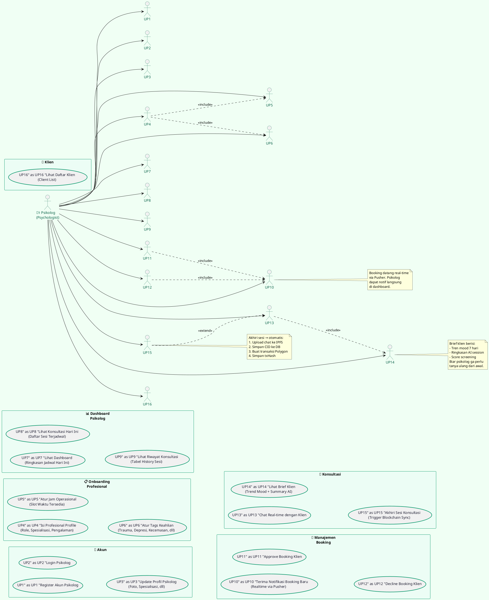

# 🧑‍⚕️ Use Case Diagram — Actor: Psikolog (Psychologist)

> **Fokus:** Semua use case yang dilakukan *Psikolog* saja. User & Sistem tidak dibahas di sini.
>
> Render diagram ini di [PlantUML Editor](https://www.plantuml.com/plantuml/uml/).

---

## Use Case — Psikolog



---

## Ringkasan Use Case Psikolog

| # | Use Case | Trigger | Output |
|---|----------|---------|--------|
| UP1 | Register Akun Psikolog | Psikolog baru | Akun dengan role PSYCHOLOGY |
| UP2 | Login Psikolog | Kembali pakai | Session JWT |
| UP3 | Update Profil Psikolog | Ganti foto/jam kerja | Profil terupdate |
| UP4 | Isi Profesional Profile | Pertama kali login | Profile lengkap |
| UP5 | Atur Jam Operasional | Atur ketersediaan | Slot waktu tersimpan |
| UP6 | Atur Tags Keahlian | Spesialisasi | Tags untuk filtering |
| UP7 | Lihat Dashboard | Buka dashboard | Ringkasan jadwal + statistik |
| UP8 | Lihat Konsultasi Hari Ini | Persiapan sesi | Daftar sesi hari ini |
| UP9 | Lihat Riwayat Konsultasi | Evaluasi | Table history sesi |
| UP10 | Terima Notif Booking | Ada booking baru | Notif real-time |
| UP11 | Approve Booking | Setuju terima | Status → APPROVED |
| UP12 | Decline Booking | Tidak bisa | Status → DECLINED |
| UP13 | Chat Real-time | Sesi dimulai | Chat dua arah via Pusher |
| UP14 | Lihat Brief Klien | Sebelum chat | Ringkasan kondisi klien |
| UP15 | Akhiri Sesi | Sesi selesai | IPFS + Blockchain sync |
| UP16 | Lihat Daftar Klien | Ingin lihat semua | List klien |

---

## Alur Psikolog — Sederhana (Text Diagram)

```
Login Psikolog → Onboarding Profesional (1x)
              → Dashboard
                   ↓
              Ada Booking Baru? (Realtime Notif)
              ├── Approve → Jadwal masuk daftar konsultasi
              └── Decline → User dapat notif
                   ↓
              Waktu Sesi Tiba → Buka Chat
              ├── Lihat Brief Klien (Mood + Summary AI)
              ├── Chat Real-time dengan Klien
              └── Akhiri Sesi → Blockchain Auto-Sync
                   ↓
              Sesi COMPLETED → Masuk Riwayat
```
