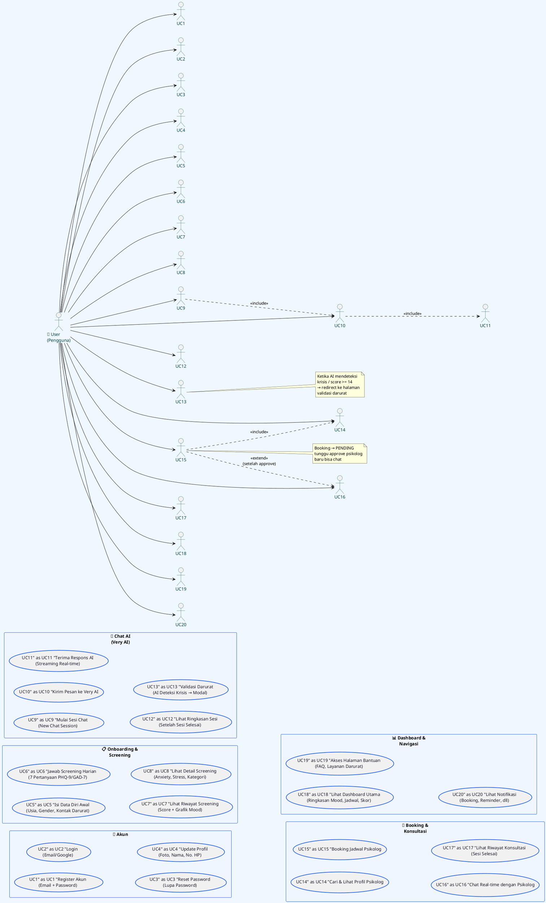

# 🧑 Use Case Diagram — Actor: User (Pengguna)

> **Fokus:** Semua use case yang dilakukan *User/Pengguna* saja. Sistem & Psikolog tidak dibahas di sini.
>
> Render diagram ini di [PlantUML Editor](https://www.plantuml.com/plantuml/uml/).

---

## Use Case — User



---

## Ringkasan Use Case User

| # | Use Case | Trigger | Output |
|---|----------|---------|--------|
| UC1 | Register Akun | User baru | Akun tersimpan di DB |
| UC2 | Login | Kembali pakai | Session JWT |
| UC3 | Reset Password | Lupa password | Email reset link |
| UC4 | Update Profil | Mau ganti foto/nama | Profil terupdate |
| UC5 | Isi Data Diri | Pertama kali | `isOnboarded = true` |
| UC6 | Screening Harian | Setiap hari | Score + Theme |
| UC7 | Lihat Riwayat Screening | Ingin lihat progres | Grafik mood chart |
| UC8 | Lihat Detail Screening | Ingin detail | Anxiety/stress breakdown |
| UC9 | Mulai Sesi Chat | Ingin curhat ke AI | ChatSession baru |
| UC10 | Kirim Pesan | Mengetik pesan | Streaming AI response |
| UC11 | Terima Respons AI | AI selesai proses | Teks real-time via Pusher |
| UC12 | Lihat Ringkasan Sesi | Sesi COMPLETED | Summary text |
| UC13 | Validasi Darurat | Krisis terdeteksi | Emergency modal + redirect |
| UC14 | Cari Psikolog | Ingin lihat opsi | Daftar psikolog + rating |
| UC15 | Booking Psikolog | Pilih jadwal | Appointment PENDING |
| UC16 | Chat Psikolog | Booking approved | Chat real-time |
| UC17 | Riwayat Konsultasi | Sesi selesai | Chat history |
| UC18 | Dashboard | Buka app | Ringkasan kondisi |
| UC19 | Bantuan | Butuh info darurat | FAQ + kontak krisis |
| UC20 | Notifikasi | Ada update | Toast/list notif |

---

## Alur User — Sederhana (Text Diagram)

```
Landing → Login/Register
       → Onboarding (1x)
       → Screening (harian)
            ↓
       Score < 14? → Arahkan (pilih):
       │               ├─ Chat Very AI → Kirim pesan → Streaming → Summary → [Booking?]
       │               ├─ Booking Psikolog → Pilih → Tunggu Approve → Chat
       │               ├─ Bantuan (FAQ Krisis)
       │               └─ Dashboard (Mood chart, Riwayat)
       │
       Score >= 14? → Validasi Darurat → Emergency modal → Hubungi 119
```
