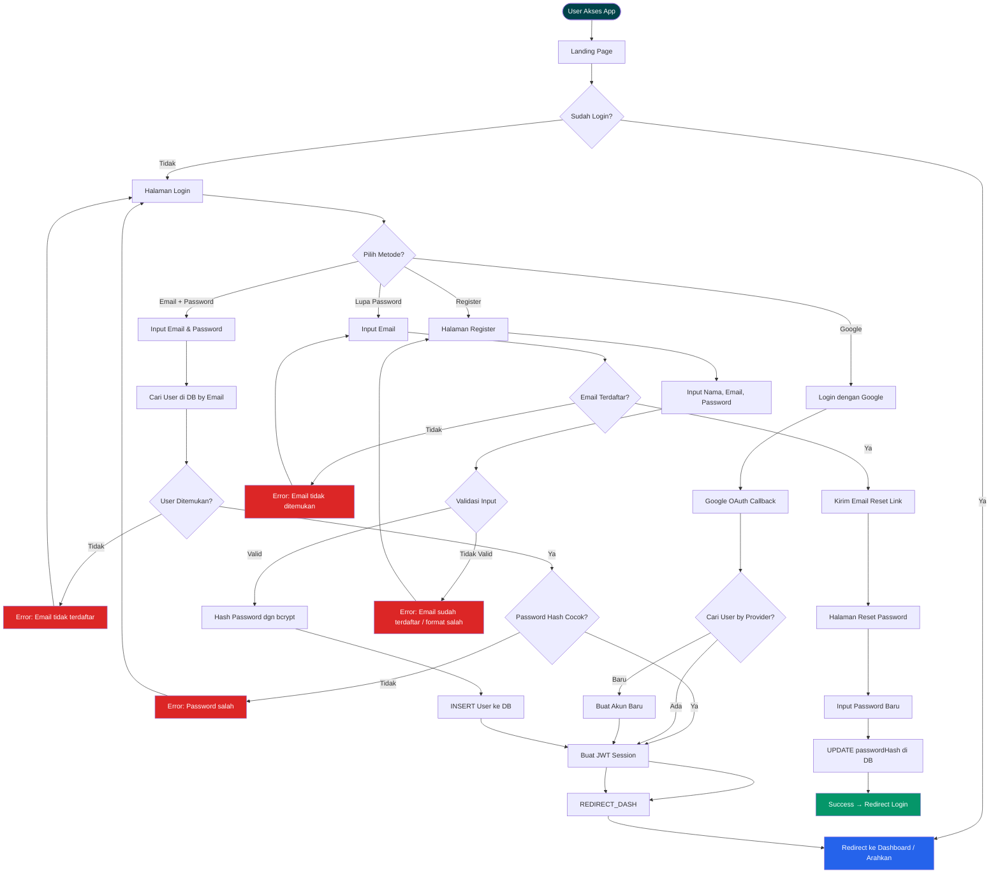
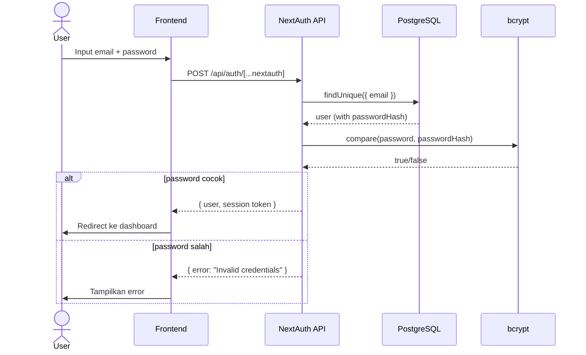
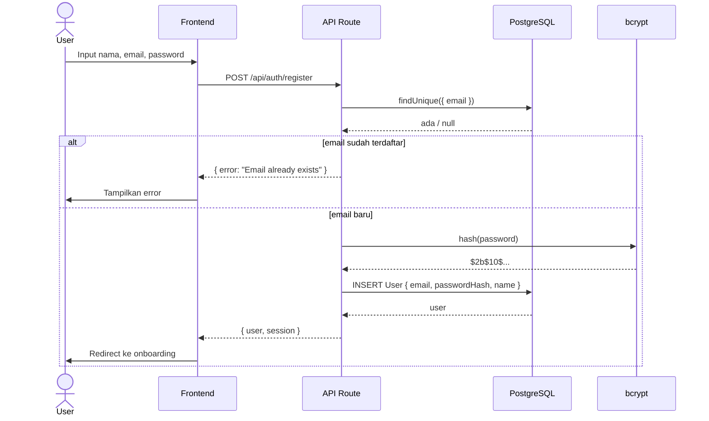

# 🔐 System Flowchart — Auth System

> **Deskripsi:** Alur autentikasi — register, login, reset password, OTP.

```mermaid
graph TD
    START([User Akses App]) --> LANDING[Landing Page]
    LANDING --> CHECK_SESSION{Sudah Login?}
    
    CHECK_SESSION -->|Ya| DASHBOARD[Redirect ke Dashboard / Arahkan]
    CHECK_SESSION -->|Tidak| LOGIN_PAGE[Halaman Login]

    LOGIN_PAGE --> LOGIN_METHOD{Pilih Metode?}
    LOGIN_METHOD -->|Email + Password| CREDENTIALS[Input Email & Password]
    LOGIN_METHOD -->|Google| GOOGLE_OAUTH[Login dengan Google]
    LOGIN_METHOD -->|Register| REGISTER_PAGE[Halaman Register]
    LOGIN_METHOD -->|Lupa Password| FORGOT_PASS[Input Email]

    CREDENTIALS --> CekDB[Cari User di DB by Email]
    CekDB --> USER_EXIST{User Ditemukan?}
    USER_EXIST -->|Tidak| ERROR_CRED[Error: Email tidak terdaftar]
    ERROR_CRED --> LOGIN_PAGE
    USER_EXIST -->|Ya| CHECK_PASS{Password Hash Cocok?}
    CHECK_PASS -->|Tidak| ERROR_PASS[Error: Password salah]
    ERROR_PASS --> LOGIN_PAGE
    CHECK_PASS -->|Ya| CREATE_SESSION[Buat JWT Session]
    CREATE_SESSION --> REDIRECT_DASH

    GOOGLE_OAUTH --> GOOGLE_CALLBACK[Google OAuth Callback]
    GOOGLE_CALLBACK --> CEK_GOOGLE_USER{Cari User by Provider?}
    CEK_GOOGLE_USER -->|Ada| CREATE_SESSION
    CEK_GOOGLE_USER -->|Baru| BUAT_AKUN_GOOGLE[Buat Akun Baru]
    BUAT_AKUN_GOOGLE --> CREATE_SESSION

    REGISTER_PAGE --> INPUT_REG[Input Nama, Email, Password]
    INPUT_REG --> VALIDATE_REG{Validasi Input}
    VALIDATE_REG -->|Tidak Valid| ERROR_VALID[Error: Email sudah terdaftar / format salah]
    ERROR_VALID --> REGISTER_PAGE
    VALIDATE_REG -->|Valid| HASH_PASS[Hash Password dgn bcrypt]
    HASH_PASS --> CREATE_USER[INSERT User ke DB]
    CREATE_USER --> CREATE_SESSION

    FORGOT_PASS --> CEK_EMAIL_REG{Email Terdaftar?}
    CEK_EMAIL_REG -->|Tidak| ERROR_FORGOT[Error: Email tidak ditemukan]
    ERROR_FORGOT --> FORGOT_PASS
    CEK_EMAIL_REG -->|Ya| SEND_RESET_LINK[Kirim Email Reset Link]
    SEND_RESET_LINK --> RESET_PAGE[Halaman Reset Password]
    RESET_PAGE --> INPUT_NEW_PASS[Input Password Baru]
    INPUT_NEW_PASS --> UPDATE_PASS[UPDATE passwordHash di DB]
    UPDATE_PASS --> SUCCESS_RESET[Success → Redirect Login]

    REDIRECT_DASH --> DASHBOARD
    CREATE_SESSION --> REDIRECT_DASH

    style START fill:#004349,color:#fff
    style DASHBOARD fill:#2563EB,color:#fff
    style ERROR_CRED fill:#DC2626,color:#fff
    style ERROR_PASS fill:#DC2626,color:#fff
    style ERROR_VALID fill:#DC2626,color:#fff
    style ERROR_FORGOT fill:#DC2626,color:#fff
    style SUCCESS_RESET fill:#059669,color:#fff
```

## Sequence Auth — Login dengan Credentials

```mermaid
sequenceDiagram
    actor U as User
    participant FE as Frontend
    participant API as NextAuth API
    participant DB as PostgreSQL
    participant BC as bcrypt

    U->>FE: Input email + password
    FE->>API: POST /api/auth/[...nextauth]
    API->>DB: findUnique({ email })
    DB-->>API: user (with passwordHash)
    API->>BC: compare(password, passwordHash)
    BC-->>API: true/false
    alt password cocok
        API-->>FE: { user, session token }
        FE->>U: Redirect ke dashboard
    else password salah
        API-->>FE: { error: "Invalid credentials" }
        FE->>U: Tampilkan error
    end
```

## Sequence Auth — Register

```mermaid
sequenceDiagram
    actor U as User
    participant FE as Frontend
    participant API as API Route
    participant DB as PostgreSQL
    participant BC as bcrypt

    U->>FE: Input nama, email, password
    FE->>API: POST /api/auth/register
    API->>DB: findUnique({ email })
    DB-->>API: ada / null
    alt email sudah terdaftar
        API-->>FE: { error: "Email already exists" }
        FE->>U: Tampilkan error
    else email baru
        API->>BC: hash(password)
        BC-->>API: $2b$10$...
        API->>DB: INSERT User { email, passwordHash, name }
        DB-->>API: user
        API-->>FE: { user, session }
        FE->>U: Redirect ke onboarding
    end
```
