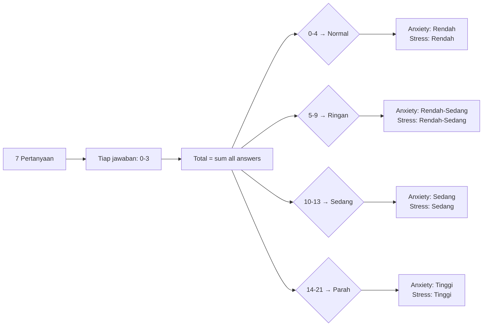
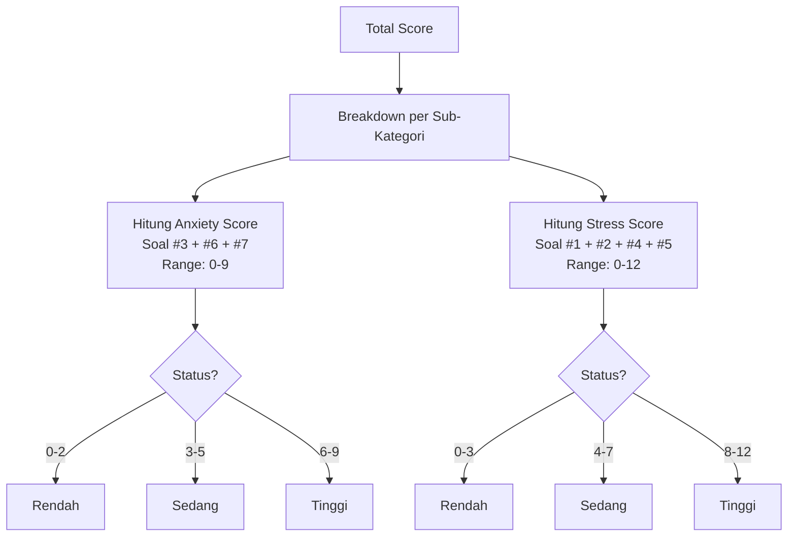

# 📋 System Flowchart — Screening System

> **Deskripsi:** Alur screening — onboarding screening, daily screening, scoring, theme mapping, history.

```mermaid
graph TD
    START([User Buka Screening]) --> GUARD_ONBOARD{Sudah Onboarding?\n(usia & jenisKelamin)}
    GUARD_ONBOARD -->|Belum| REDIRECT_ONBOARD[Redirect ke /onboarding]
    GUARD_ONBOARD -->|Ya| GUARD_LOGIN{Sudah Login?}
    GUARD_LOGIN -->|Belum| REDIRECT_LOGIN[Redirect ke /login]
    GUARD_LOGIN -->|Ya| CHECK_TODAY{Sudah Screening Hari Ini?}

    CHECK_TODAY -->|Ya, sudah| REDIRECT_DASH[Redirect ke Dashboard / Arahkan]
    CHECK_TODAY -->|Belum| SHOW_SCREENING[Tampilkan Form Screening<br>7 Pertanyaan]

    SHOW_SCREENING --> USER_ANSWERS[User Jawab 7 Soal<br>5 opsi: 0-3 tiap soal]
    USER_ANSWERS --> SUBMIT[Submit Jawaban]
    SUBMIT --> CALC_SCORE[Hitung Total Score<br>Range: 0 - 21]

    CALC_SCORE --> DETERMINE_THEME{Tentukan Theme & Kategori}
    DETERMINE_THEME -->|Score 0-4| THEME_BLUE[Theme: calm_blue<br>Kategori: Normal]
    DETERMINE_THEME -->|Score 5-9| THEME_YELLOW[Theme: warm_yellow<br>Kategori: Ringan]
    DETERMINE_THEME -->|Score 10-13| THEME_ORANGE[Theme: alert_orange<br>Kategori: Sedang]
    DETERMINE_THEME -->|Score 14-21| THEME_PURPLE[Theme: deep_purple<br>Kategori: Parah / Sangat Parah]

    THEME_BLUE --> SAVE_RESULT[Simpan Screening ke DB<br>INSERT Screening {score, answer, type}]
    THEME_YELLOW --> SAVE_RESULT
    THEME_ORANGE --> SAVE_RESULT
    THEME_PURPLE --> SAVE_RESULT

    SAVE_RESULT --> CHECK_CRISIS{Score >= 14?}
    CHECK_CRISIS -->|Ya (Kritis)| REDIRECT_VALIDASI[Redirect ke /validasi<br>Tampilkan Emergency Banner<br>Rekomendasi Hubungi 119]
    CHECK_CRISIS -->|Tidak (Aman)| REDIRECT_ARAHKAN[Redirect ke /arahkan<br>Pilihan: Chat / Booking / Bantuan]

    REDIRECT_ONBOARD --> ONBOARDING_FORM[Form Usia, Gender, Kontak Darurat]
    ONBOARDING_FORM --> SAVE_ONBOARD[UPDATE User<br>set isOnboarded=true]
    SAVE_ONBOARD --> CHECK_TODAY

    REDIRECT_LOGIN --> LOGIN_PAGE[Halaman Login]
    REDIRECT_DASH --> DASHBOARD[Dashboard / Arahkan]

    style START fill:#004349,color:#fff
    style REDIRECT_VALIDASI fill:#DC2626,color:#fff
    style REDIRECT_ARAHKAN fill:#059669,color:#fff
    style THEME_BLUE fill:#BFDBFE,color:#000
    style THEME_YELLOW fill:#FDE68A,color:#000
    style THEME_ORANGE fill:#FED7AA,color:#000
    style THEME_PURPLE fill:#C4B5FD,color:#000
```

## Scoring Logic



## Breakdown Anxiety & Stress



## Theme Mapping → Dynamic Theming

```mermaid
graph LR
    SCREENING_SCORE[Score Screening] --> THEME[Theme Enum]
    THEME -->|calm_blue| BLUE_PALETTE[Bg: sky-50/50<br>Primary: #004349<br>Accent: Blue pastel]
    THEME -->|warm_yellow| YELLOW_PALETTE[Bg: amber-50/40<br>Primary: #92400E<br>Accent: Warm kuning]
    THEME -->|alert_orange| ORANGE_PALETTE[Bg: orange-50/40<br>Primary: #9A3412<br>Accent: Orange]
    THEME -->|deep_purple| PURPLE_PALETTE[Bg: indigo-50/40<br>Primary: #4C1D95<br>Accent: Purple]
    
    BLUE_PALETTE --> APPLY[Apply ke CSS Variables<br>di ThemeProvider (Zustand)]
    YELLOW_PALETTE --> APPLY
    ORANGE_PALETTE --> APPLY
    PURPLE_PALETTE --> APPLY
    APPLY --> RENDER[Semua komponen<br>pakai theme ini]
```
