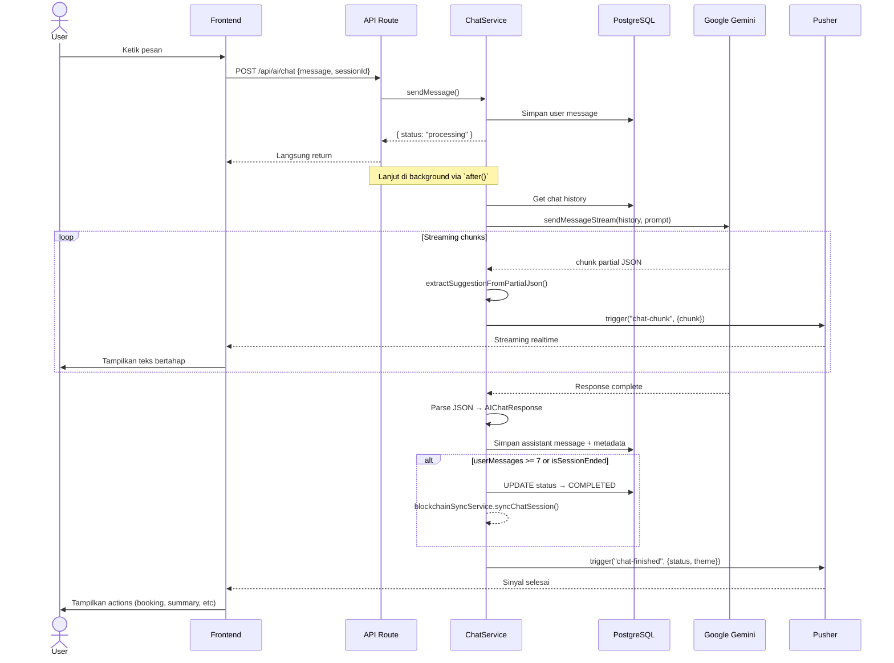

# 🤖 System Flowchart — AI Chat System (Very AI)

> **Deskripsi:** Alur chat AI — mulai sesi, kirim pesan, streaming Gemini, session sealing, blockchain sync.

```mermaid
graph TD
    START([User Klik Chat Very AI]) --> GUARD_SCREEN{Screening Sebelumnya?}
    GUARD_SCREEN -->|Belum screening hari ini| REDIRECT_SCREEN[Redirect ke /screening]
    GUARD_SCREEN -->|Sudah| CHECK_SESSION{Sesi Aktif?<br>ada ChatSession ACTIVE?}
    
    CHECK_SESSION -->|Tidak| CREATE_SESSION[POST /api/ai/session<br>INSERT ChatSession ke DB]
    CHECK_SESSION -->|Ya| USE_SESSION[Pakai sesi yang ada]
    
    CREATE_SESSION --> LOAD_UI[Tampilkan Chat UI<br>+ Dynamic Theme dari Screening]
    USE_SESSION --> LOAD_UI

    LOAD_UI --> USER_INPUT[User Mengetik Pesan]
    USER_INPUT --> SEND_MSG[POST /api/ai/chat<br>{ message, sessionId }]
    SEND_MSG --> API_RESPONSE[Return { status: "processing" }<br>— Langsung balik ke frontend]

    API_RESPONSE --> SAVE_USER_MSG[Simpan pesan user ke DB]
    SAVE_USER_MSG --> CHECK_TURN{Turn == 0?<br>First Message?}
    
    CHECK_TURN -->|Ya, pesan pertama| LOAD_PROMPT[Load screening terakhir<br>+ Trigger Prompt + Theme]
    CHECK_TURN -->|Bukan| SKIP_PROMPT[Pakai history saja]

    LOAD_PROMPT --> FORMAT_HISTORY[Format semua chat jadi<br>paired turns: User + AI]
    SKIP_PROMPT --> FORMAT_HISTORY

    FORMAT_HISTORY --> CALL_GEMINI[Call Google Gemini<br>sendMessageStream()]

    subgraph "⚡ AI Streaming Process"
        CALL_GEMINI --> STREAM_LOOP[Loop: terima chunk dari Gemini]
        STREAM_LOOP --> EXTRACT_SUGGESTION[extractSuggestionFromPartialJson<br>— Parse "suggestion" field partial JSON]
        EXTRACT_SUGGESTION --> CHUNK_NEW{Ada teks baru?}
        CHUNK_NEW -->|Ya| PUSH_CHUNK[Pusher trigger "chat-chunk"<br>→ streaming ke frontend]
        PUSH_CHUNK --> STREAM_LOOP
        CHUNK_NEW -->|Tidak| STREAM_LOOP
        
        STREAM_LOOP --> RESPONSE_COMPLETE[Response lengkap dari Gemini]
    end

    RESPONSE_COMPLETE --> PARSE_JSON[AIResponseFormatter<br>Parse JSON → AIChatResponse]
    PARSE_JSON --> PARSE_OK{Parse Berhasil?}
    
    PARSE_OK -->|Error| SAVE_ERROR_MSG[Simpan error message<br>ke DB + Pusher "chat-finished" error]
    PARSE_OK -->|Sukses| SAVE_AI_RESPONSE[Simpan assistant message ke DB<br>{ content, metaData, uiTheme }]

    SAVE_AI_RESPONSE --> CHECK_FINAL{Ada finalConclusion?}
    CHECK_FINAL -->|Ya| SAVE_SUMMARY[Create/Update SessionSummary]
    CHECK_FINAL -->|Tidak| SKIP_SUMMARY

    SAVE_SUMMARY --> CHECK_END_SESSION{Hitung userMessages >= 7<br>ATAU isSessionEnded = true?}
    SKIP_SUMMARY --> CHECK_END_SESSION

    CHECK_END_SESSION -->|Ya| SEAL_SESSION[UPDATE status → COMPLETED]
    CHECK_END_SESSION -->|Tidak| NOTIF_FINISHED[Pusher trigger "chat-finished"<br>→ frontend siap terima pesan baru]

    SEAL_SESSION --> BLOCKCHAIN_SYNC[Background: blockchainSyncService<br>Upload ke IPFS + Polygon]
    BLOCKCHAIN_SYNC --> NOTIF_FINISHED

    NOTIF_FINISHED --> WAIT_NEXT[Menunggu pesan berikutnya]

    style START fill:#004349,color:#fff
    style CALL_GEMINI fill:#4285F4,color:#fff
    style PUSH_CHUNK fill:#2563EB,color:#fff
    style SEAL_SESSION fill:#059669,color:#fff
    style BLOCKCHAIN_SYNC fill:#7C3AED,color:#fff
    style SAVE_ERROR_MSG fill:#DC2626,color:#fff
```

## Sequence — AI Chat Streaming



## AI Response JSON Structure

```json
{
  "suggestion": "Halo! Ceritakan apa yang kamu rasakan...",
  "finalConclusion": null,
  "metaData": {
    "uiTheme": "calm_blue",
    "isCrisis": false,
    "needPsychologist": false,
    "isSessionEnded": false,
    "analysis": {
      "anxietyLevel": "Rendah",
      "insomniaLevel": "Rendah",
      "depressionLevel": "Rendah",
      "aiValidationAdvice": "Kondisi kamu masih dalam batas normal..."
    }
  }
}
```
