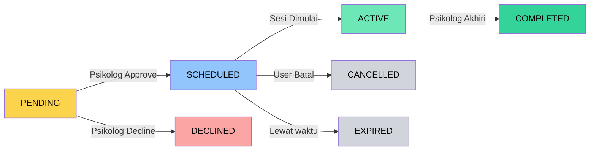
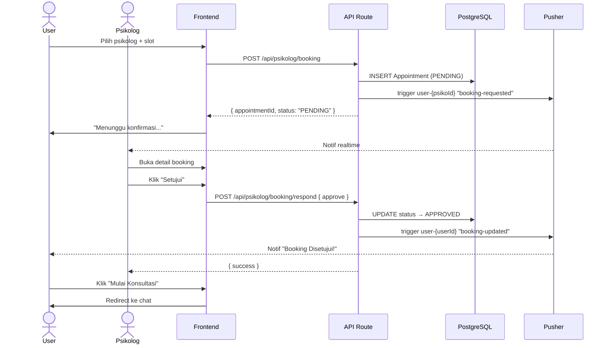

# 📅 System Flowchart — Booking System

> **Deskripsi:** Alur booking psikolog — cari psikolog, booking, approve/decline, jadwal.

```mermaid
graph TD
    START([User Buka Halaman Arahkan / Booking]) --> LOAD_PSIKOLOG[GET /api/psikolog/booking<br>Ambil daftar psikolog + slot tersedia]
    LOAD_PSIKOLOG --> SHOW_LIST[Tampilkan Kartu Psikolog<br>Nama, Rating, Spesialisasi, Harga]
    
    SHOW_LIST --> USER_PICK[User Pilih Psikolog]
    USER_PICK --> SHOW_SLOTS[Tampilkan Slot Tersedia<br>— Dari operationalHours psikolog]
    
    SHOW_SLOTS --> USER_SELECT_SLOT[User Pilih Jam + Tanggal]
    USER_SELECT_SLOT --> CONFIRM_BOOKING[Konfirmasi Booking]
    
    CONFIRM_BOOKING --> SUBMIT_BOOKING[POST /api/psikolog/booking<br>{ psychologistId, scheduledAt }]
    SUBMIT_BOOKING --> CREATE_APPOINTMENT[INSERT Appointment<br>status: PENDING]
    CREATE_APPOINTMENT --> NOTIF_PSIKOLOG[Pusher trigger ke channel psikolog<br>"booking-requested"]
    
    NOTIF_PSIKOLOG --> USER_WAIT[Tampilkan "Menunggu Konfirmasi Psikolog"]
    USER_WAIT --> POLL_OR_PUSHER[Dengarkan event Pusher<br>"booking-updated"]

    subgraph "🧑‍⚕️ Psikolog Side"
        PSIKOLOG_NOTIF[Psikolog terima notif<br>realtime di dashboard] --> PSIKOLOG_VIEW[Lihat detail booking<br>Nama user, jam, tanggal]
        PSIKOLOG_VIEW --> PSIKOLOG_DECIDE{Apakah Setuju?}
        
        PSIKOLOG_DECIDE -->|Ya| POST_APPROVE[POST /api/psikolog/booking/respond<br>{ action: "approve" }]
        PSIKOLOG_DECIDE -->|Tidak| POST_DECLINE[POST /api/psikolog/booking/respond<br>{ action: "decline" }]
        
        POST_APPROVE --> UPDATE_APPROVED[UPDATE Appointment<br>status → APPROVED]
        UPDATE_APPROVED --> NOTIF_USER_APPROVE[Pusher → user<br>"booking-updated" approved]
        
        POST_DECLINE --> UPDATE_DECLINED[UPDATE Appointment<br>status → DECLINED]
        UPDATE_DECLINED --> NOTIF_USER_DECLINE[Pusher → user<br>"booking-updated" declined]
    end

    NOTIF_USER_APPROVE --> USER_APPROVED[Tampilkan "Booking Disetujui!"<br>Tombol: Mulai Konsultasi]
    NOTIF_USER_DECLINE --> USER_DECLINED[Tampilkan "Booking Ditolak"<br>Saran: Booking psikolog lain]
    
    USER_APPROVED --> REDIRECT_CONSULT[Redirect ke /konsultasi?appointmentId=X]
    USER_DECLINED --> SHOW_LIST

    style START fill:#004349,color:#fff
    style POST_APPROVE fill:#059669,color:#fff
    style POST_DECLINE fill:#DC2626,color:#fff
    style NOTIF_USER_APPROVE fill:#059669,color:#fff
    style NOTIF_USER_DECLINE fill:#DC2626,color:#fff
```

## Status Lifecycle Appointment



## Sequence — Booking Flow


