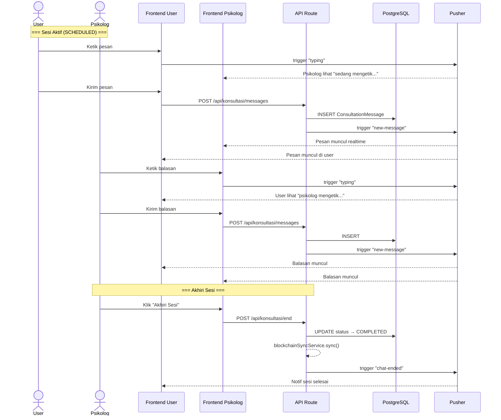

# 💬 System Flowchart — Realtime Chat System (Konsultasi)

> **Deskripsi:** Alur chat real-time antara User dan Psikolog via Pusher.

```mermaid
graph TD
    START([User Klik Mulai Konsultasi]) --> LOAD_ROOM[GET /api/konsultasi/messages?appointmentId=X<br>Load history chat]
    LOAD_ROOM --> SHOW_UI[Tampilkan Chat UI<br>— Sidebar pesan, input, typing indicator]
    
    SHOW_UI --> SUBSCRIBE_PUSHER[Subscribe ke Pusher channel<br>user-{userId} + user-{psikoId}]
    SUBSCRIBE_PUSHER --> IDLE[Menunggu aktivitas]

    subgraph "📤 User Kirim Pesan"
        USER_TYPE[User mengetik] --> TYPING_EVENT[Pusher trigger "typing"<br>— Psikolog lihat "sedang mengetik"]
        USER_TYPE --> USER_SEND[User klik Kirim]
        USER_SEND --> POST_MSG[POST /api/konsultasi/messages<br>{ appointmentId, text, sender: "user" }]
        POST_MSG --> SAVE_DB[INSERT ConsultationMessage ke DB]
        SAVE_DB --> BROADCAST_USER[Pusher trigger ke channel psikolog<br>"new-message" with message data]
        BROADCAST_USER --> SHOW_USER_MSG[Tampilkan pesan di chat kedua pihak]
    end

    subgraph "📥 Psikolog Kirim Balasan"
        PSIKO_TYPE[Psikolog mengetik] --> TYPING_PSIKO[Pusher trigger "typing"<br>— User lihat "psikolog sedang mengetik"]
        PSIKO_TYPE --> PSIKO_SEND[Psikolog klik Kirim]
        PSIKO_SEND --> POST_PSIKO[POST /api/konsultasi/messages<br>{ appointmentId, text, sender: "psychologist" }]
        POST_PSIKO --> SAVE_DB_PSIKO[INSERT ConsultationMessage]
        SAVE_DB_PSIKO --> BROADCAST_PSIKO[Pusher trigger ke channel user<br>"new-message"]
        BROADCAST_PSIKO --> SHOW_PSIKO_MSG[Tampilkan di chat kedua pihak]
    end

    subgraph "📡 Pusher Events"
        direction TB
        EVENT1["channel: user-{userId}<br>• new-message<br>• typing<br>• chat-ended"]
        EVENT2["channel: user-{psikoId}<br>• new-message<br>• typing<br>• booking-updated"]
    end

    subgraph "⏹️ Psikolog Akhiri Sesi"
        PSIKO_END[Psikolog klik "Akhiri Sesi"] --> CONFIRM_END{Konfirmasi?}
        CONFIRM_END -->|Ya| POST_END[POST /api/konsultasi/end<br>{ appointmentId }]
        CONFIRM_END -->|Batal| IDLE
        POST_END --> UPDATE_COMPLETED[UPDATE Appointment status → COMPLETED]
        UPDATE_COMPLETED --> TRIGGER_BLOCKCHAIN[Blockchain Sync<br>Upload chat ke IPFS + Polygon]
        TRIGGER_BLOCKCHAIN --> NOTIF_USER_END[Pusher "chat-ended" ke user<br>— User lihat sesi selesai]
        NOTIF_USER_END --> REDIRECT_DASH[Redirect user ke Dashboard]
    end

    IDLE --> USER_TYPE
    IDLE --> PSIKO_TYPE
    IDLE --> PSIKO_END

    style START fill:#004349,color:#fff
    style POST_MSG fill:#2563EB,color:#fff
    style POST_PSIKO fill:#059669,color:#fff
    style POST_END fill:#DC2626,color:#fff
    style TRIGGER_BLOCKCHAIN fill:#7C3AED,color:#fff
```

## Sequence — Konsultasi Chat


