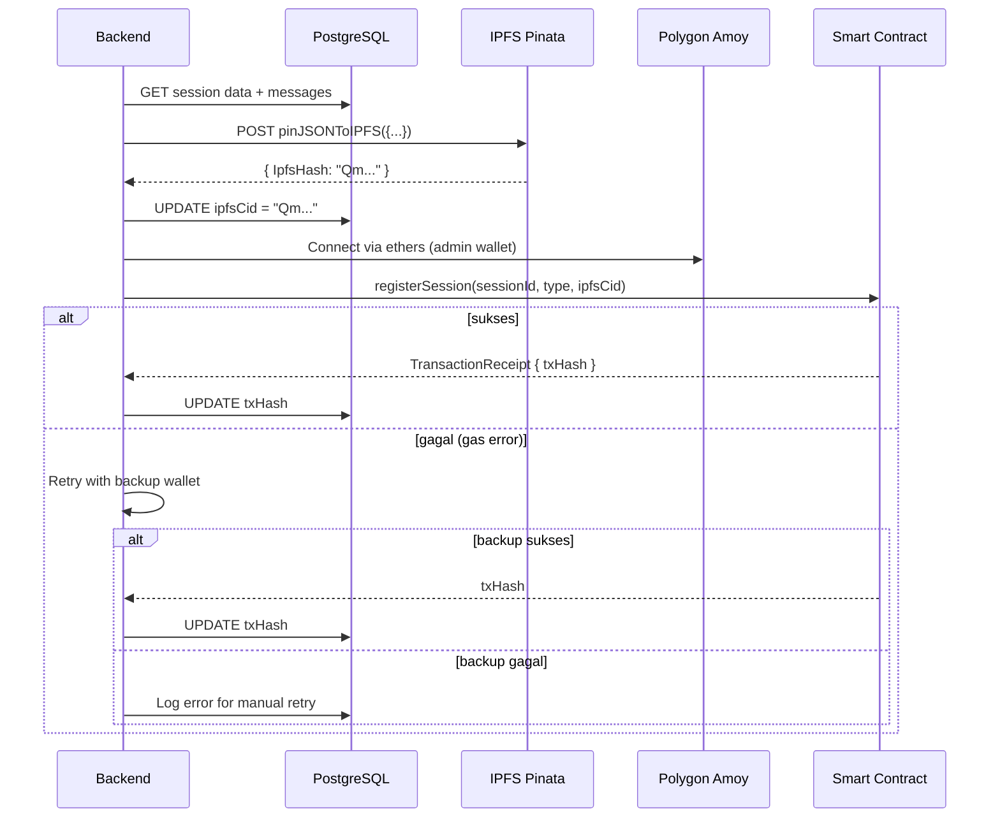

# ⛓️ System Flowchart — Blockchain System

> **Deskripsi:** Alur blockchain sync — upload ke IPFS Pinata, transaksi Polygon Amoy, verifikasi on-chain.

```mermaid
graph TD
    START([Trigger: Sesi Selesai]) --> TRIGGER_TYPE{Apa trigger-nya?}

    TRIGGER_TYPE -->|Chat AI: userMessages >= 7| AI_COMPLETED[ChatSession status → COMPLETED]
    TRIGGER_TYPE -->|Chat AI: isSessionEnded = true| AI_COMPLETED
    TRIGGER_TYPE -->|Konsultasi: psikolog end sesi| KONSULTASI_COMPLETED[Appointment status → COMPLETED]
    
    AI_COMPLETED --> SYNC_AI[blockchainSyncService.syncChatSession(sessionId)]
    KONSULTASI_COMPLETED --> SYNC_KONSULTASI[blockchainSyncService.syncAppointment(appointmentId)]
    
    SYNC_AI --> CHECK_DATA{Cek data sesi<br>sudah lengkap?}
    SYNC_KONSULTASI --> CHECK_DATA

    CHECK_DATA -->|Tidak lengkap| LOG_ERROR[Log error + return]
    CHECK_DATA -->|Lengkap| BUILD_PAYLOAD[Buat payload JSON untuk IPFS<br>{
      sessionId,
      type: "AI"/"Psychologist",
      messages: [...],
      summary: "...",
      timestamp
    }]

    BUILD_PAYLOAD --> UPLOAD_IPFS[Upload ke IPFS via Pinata API<br>POST https://api.pinata.cloud/pinning/pinJSONToIPFS]
    UPLOAD_IPFS --> PINATA_OK{Upload Berhasil?}
    
    PINATA_OK -->|Gagal| RETRY_IPFS[Coba ulang 3x<br>Kalau gagal → log error + simpan di retry queue]
    RETRY_IPFS --> UPLOAD_IPFS
    
    PINATA_OK -->|Sukses| SAVE_CID[Simpan ipfsCid ke DB<br>UPDATE ChatSession / Appointment]
    
    SAVE_CID --> GET_WALLET[Ambil wallet Admin<br>dari env: ADMIN_WALLET_PRIVATE_KEY]
    GET_WALLET --> BUILD_TX[Build transaksi Polygon<br>Contract: SessionRegistry.registerSession()]
    
    BUILD_TX --> ESTIMATE_GAS[Estimasi gas + set gasPrice]
    ESTIMATE_GAS --> SIGN_TX[Sign transaksi dgn private key]
    SIGN_TX --> SEND_TX[Kirim transaksi ke Polygon Amoy RPC]
    
    SEND_TX --> TX_OK{Transaksi Sukses?}
    
    TX_OK -->|Gagal (gas, RPC error)| RETRY_TX{Coba wallet lain?<br>Wallet rotation failover}
    RETRY_TX -->|Ya, ada wallet backup| SWITCH_WALLET[Ganti private key]
    SWITCH_WALLET --> BUILD_TX
    RETRY_TX -->|Tidak| FAILURE_LOG[Log critical error<br>Manual retry via UI "Retry Sync"]
    FAILURE_LOG --> SHOW_BADGE[Tampilkan badge "Sync Failed"<br>di UI dengan tombol retry]
    
    TX_OK -->|Sukses| SAVE_TXHASH[Simpan txHash ke DB]
    SAVE_TXHASH --> SHOW_SUCCESS[Tampilkan badge "On-Chain ✓"<br>Link ke Polygonscan]

    subgraph "🔄 Verifikasi On-Chain"
        VERIFY_START[GET /api/blockchain/verify?sessionId=X] --> FETCH_DB[Ambil sessionId + txHash dari DB]
        FETCH_DB --> CALL_CONTRACT[Call contract.read.getSession(sessionId)]
        CALL_CONTRACT --> VERIFY_OK{Data cocok?<br>CID = ipfsCid dari DB?}
        VERIFY_OK -->|Cocok| VERIFY_PASS[✅ Data terverifikasi<br>Tidak ada perubahan]
        VERIFY_OK -->|Tidak cocok| VERIFY_FAIL[❌ Data tidak cocok<br>Kemungkinan manipulasi]
    end

    subgraph "🔄 Sync Ulang Manual (Retry)"
        RETRY_BTN[User klik "Retry Sync" di UI] --> GET_CURRENT_DATA[Ambil data sesi dari DB]
        GET_CURRENT_DATA --> UPLOAD_IPFS
    end

    style START fill:#004349,color:#fff
    style UPLOAD_IPFS fill:#0891B2,color:#fff
    style SEND_TX fill:#7C3AED,color:#fff
    style VERIFY_PASS fill:#059669,color:#fff
    style VERIFY_FAIL fill:#DC2626,color:#fff
    style SHOW_SUCCESS fill:#059669,color:#fff
    style SHOW_BADGE fill:#F59E0B,color:#000
```

## Blockchain Architecture

```mermaid
graph LR
    A[Next.js Backend] -->|1. Upload JSON| B[IPFS Pinata]
    B -->|2. Return CID| A
    A -->|3. registerSession<br>{sessionId, ipfsCid}| C[Polygon Amoy<br>Smart Contract]
    C -->|4. txHash| A
    A -->|5. Simpan| D[PostgreSQL<br>ipfsCid + txHash]
    
    E[User / Anyone] -->|6. Verifikasi| F[GET /api/blockchain/verify]
    F -->|7. Call getSession| C
    F -->|8. Bandingkan CID| D
    
    style B fill:#0891B2,color:#fff
    style C fill:#7C3AED,color:#fff
```

## Smart Contract: SessionRegistry

```
Contract: 0x... deployed on Polygon Amoy Testnet

Function registerSession(sessionId, sessionType, ipfsCid)
  - onlyOwner (admin wallet)
  - Menyimpan: sessionId → { sessionType, ipfsCid, timestamp, registeredBy }

Function getSession(sessionId) → view
  - Public
  - Return: { id, sessionType, ipfsCid, timestamp, registeredBy }
```

## Sequence — Blockchain Sync


