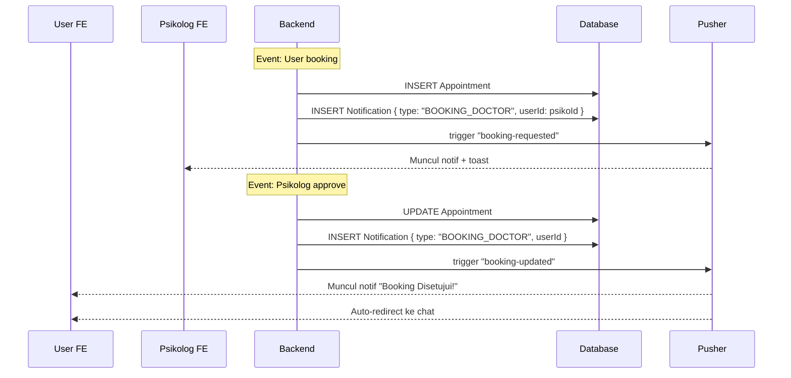

# 🔔 System Flowchart — Notification System

> **Deskripsi:** Alur notifikasi real-time via Pusher + notifikasi tersimpan di DB.

```mermaid
graph TD
    START([Event Terjadi]) --> EVENT_TYPE{Event Type?}
    
    EVENT_TYPE -->|Booking Baru| E_BOOKING[Pusher: "booking-requested"<br>→ Psikolog channel]
    EVENT_TYPE -->|Booking Approve| E_APPROVE[Pusher: "booking-updated" approved<br>→ User channel]
    EVENT_TYPE -->|Booking Decline| E_DECLINE[Pusher: "booking-updated" declined<br>→ User channel]
    EVENT_TYPE -->|Pesan Chat Baru| E_CHAT[Pusher: "new-message"<br>→ Channel lawan bicara]
    EVENT_TYPE -->|AI Chat Chunk| E_CHUNK[Pusher: "chat-chunk"<br>→ User channel]
    EVENT_TYPE -->|AI Chat Selesai| E_FINISHED[Pusher: "chat-finished"<br>→ User channel]
    EVENT_TYPE -->|Psikolog Typing| E_TYPING[Pusher: "typing"<br>→ User channel]
    EVENT_TYPE -->|Sesi Berakhir| E_END[Pusher: "chat-ended"<br>→ User channel]
    EVENT_TYPE -->|Reminder Screening| E_REMINDER[System: Cron job<br>→ Cek belum screening hari ini]

    E_BOOKING --> SAVE_NOTIF_DB[Simpan ke DB<br>INSERT Notification { type, userId, title, message }]
    E_APPROVE --> SAVE_NOTIF_DB
    E_DECLINE --> SAVE_NOTIF_DB
    E_CHAT --> SKIP_DB[Event chat realtime → skip DB<br>Cukup Pusher]
    E_CHUNK --> SKIP_DB
    E_FINISHED --> SKIP_DB
    E_TYPING --> SKIP_DB
    E_END --> SAVE_NOTIF_DB

    SAVE_NOTIF_DB --> PUSH_PUSHER[Trigger Pusher ke channel user]
    PUSH_PUSHER --> FE_HANDLE[Frontend handle event]

    subgraph "📱 Frontend Handle"
        FE_HANDLE --> SHOW_TOAST[Tampilkan Sonner toast]
        FE_HANDLE --> UPDATE_BADGE[Update badge notifikasi di navbar]
        FE_HANDLE --> ADD_LIST[Tambah ke NotificationList]
        FE_HANDLE --> AUTO_REDIRECT[Auto-redirect kalo perlu<br>Misal: booking approved → redirect]
    end

    subgraph "⏰ Cron Job (node-cron)"
        CRON_START[Cron: tiap jam 20:00] --> FETCH_USERS[Ambil user yang<br>belum screening hari ini]
        FETCH_USERS --> QUEUE_NOTIF[INSERT Notification<br>reminder screening]
        QUEUE_NOTIF --> BATCH_PUSH[Push notif via Pusher<br>ke semua user]
    end

    subgraph "📋 Notification List"
        NOTIF_LIST[User Buka Notifikasi] --> FETCH_NOTIFS[GET /api/notifications<br>Ambil semua notif user]
        FETCH_NOTIFS --> MARK_READ[POST /api/notifications/read<br>Mark notif sebagai dibaca]
        MARK_READ --> HIDE_BADGE[Hilangkan badge unread]
    end

    style START fill:#004349,color:#fff
    style E_BOOKING fill:#F59E0B,color:#000
    style E_APPROVE fill:#059669,color:#fff
    style E_DECLINE fill:#DC2626,color:#fff
    style E_CHAT fill:#2563EB,color:#fff
    style E_CHUNK fill:#6366F1,color:#fff
    style AUTO_REDIRECT fill:#059669,color:#fff
```

## Notification Types

```typescript
type NotificationType =
  | "UNREAD_CHAT"       // Pesan chat konsultasi baru
  | "BOOKING_DOCTOR"    // Booking request / response
  | "APPOINTMENT_REMINDER"  // Reminder jadwal / screening
  | "CHAT_FINISHED"     // AI chat selesai
  | "SESSION_ENDED"     // Sesi konsultasi diakhiri
```

## Pusher Event Map

```mermaid
graph LR
    subgraph "Pusher Events"
        A["chat-chunk"] ---|AI Streaming| USER[Channel: user-{userId}]
        B["chat-finished"] ---|AI Selesai| USER
        C["new-message"] ---|Chat Konsultasi| USER
        C ---|Chat Konsultasi| PSIKOLOG[Channel: user-{psikoId}]
        D["typing"] ---|Indikator| USER
        D ---|Indikator| PSIKOLOG
        E["booking-requested"] ---|Booking Baru| PSIKOLOG
        F["booking-updated"] ---|Approve/Decline| USER
        G["chat-ended"] ---|Sesi Selesai| USER
    end
```

## Sequence — Notifikasi Booking


